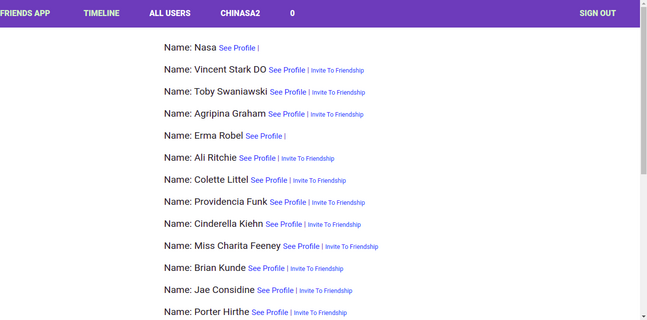
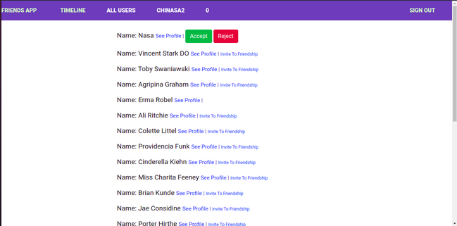

# Scaffold for social media app with Ruby on Rails

> This project is a prototype of the facebook kind of friendship where a user can send a friend request to another user.In this app, Friendship can only be established when the reciever of the friendship invitation accepts the friend request.




## Built With

- Ruby v2.7.0
- Ruby on Rails v6.1.3.1
- Bootstrap
- SQLite 3
- Devise gem
- Capybara(Integration test)
- Rspec (Unit test)
- Bootstrap
- Webpack


## Live Demo

-[@Live Demo](https://lit-depths-99700.herokuapp.com/)


## Getting Started

To get a local copy up and running follow these simple example steps.
On your terminal, run 
```
 git clone git@github.com:Nasa28/ror-social-scaffold.git

```

### Prerequisites

Ruby: 2.6.3
Rails: 5.2.3
Postgres: >=9.5

### Setup

Install webpacker with:

```
bundle exec rake webpacker:install
```

Instal gems with:

```
bundle install
```

Setup database with:

```
   rails db:create
   rails db:migrate
```

### Usage

Start server with:

```
    rails server
```

Open `http://localhost:3000/` in your browser.

### Run tests

```
    rpsec --format documentation
```

### Deployment

TBA

## Authors

👨‍💻 **Kalu Chinasa Agu**

- Github: [@Nasa28](https://github.com/Nasa28)
-  Twitter: [@Ultimate_Nasa](https://twitter.com/Ultimate_Nasa)
- LinkedIn: [LinkedIn](https://www.linkedin.com/in/kalu-chinasa-agu-a15080103/)

## 🤝 Contributing

Contributions, issues and feature requests are welcome!

Feel free to check the [issues page](issues/).

## Show your support

Give a ⭐️ if you like this project!

## Acknowledgments


-  


## 📝 License

TBA

